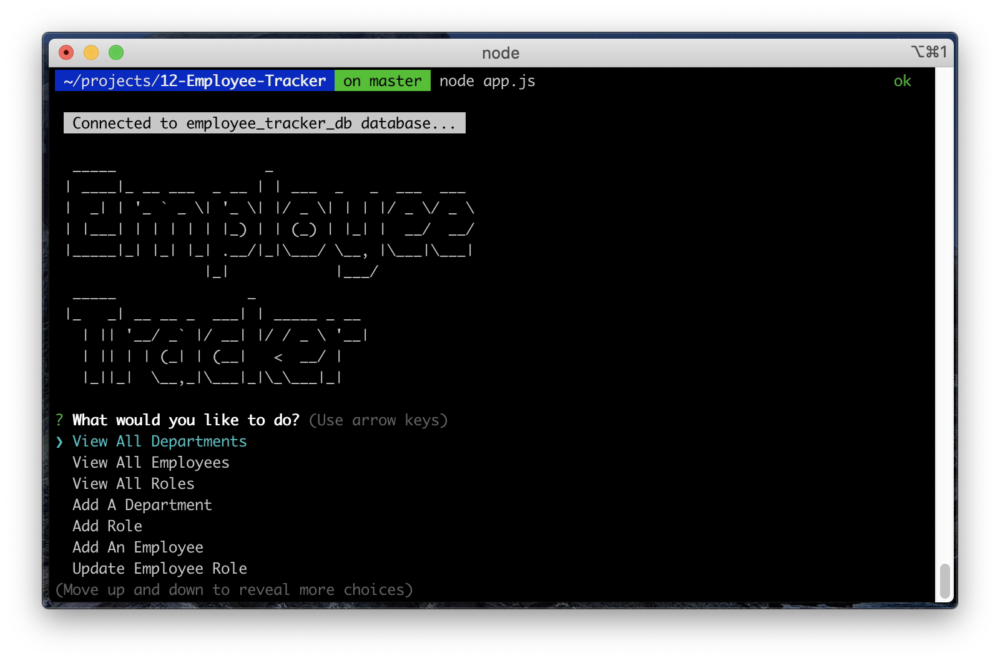

# Employee Tracker

## Table of Contents-
- [Employee Tracker App](#note-taker-utility)
  - [Table of Contents-](#table-of-contents-)
  - [Licensing](#licensing)
  - [Description](#description)
  - [Installation](#installation)
  - [Screenshots](#screenshots)
  - [Usage](#usage)
  - [Contributing](#contributing)
  - [Testing](#testing)
  - [Additional Info](#additional-info)

## Licensing

Link: [MIT License](https://opensource.org/licenses/MIT)

## Description

  This is a "command line" style application that allows a business owner to manage the employees and their roles for a small company. The text menus presented allow the user to perform multiple functions on the data:
  
*   Viewing all Department names
*   Viewing all Employees in the company database (showing ID number, First Name, Last Name, Job Title, Department, Salary, and that employee's manager name, if applicable)
*   Viewing all employee Roles
*   Adding a new Department name to Company
*   Adding a new Role to be assigned to Employees
*   Adding new Employees to Company (adding First Name, Last Name, the Role from a list, and a Manager from the Company managers in the database)
*   Updating the Role assigned to an employee

A simple main menu allows the user to choose form these functions, which produces a formatted output for "View" tasks, and input functions for adding/updating tasks.
    
## Installation

This app uses Node.js, the package.json file has all the dependancies inside. Copying the directory sturcture as-is and going to the root level then running the command 'npm install' will collect the required modules and install them.

## Screenshots

YouTube link to video walk-through of application: [https://youtu.be/jWxT9Y7GXXs](https://youtu.be/jWxT9Y7GXXs)

Main menu on startup:

## Usage

The app is launched by entering "node app.js" in the command window when inside the directory holding files.  
**NOTE:** _Suggested to use at least a width of "100" in the terminal window for best text output formatting._

## Credits

* Thanks again to my class instructor [Farish Kashefinejad](https://www.linkedin.com/in/farishkash) for his continued efforts to detail for his students the "problem solving process" through his Structured Reviews of these homework assignments.

* The open-source program [Beekeeper Studio](https://www.beekeeperstudio.io/) was very helpful in providing a toolset and environment where I could more rapidly develop the necessary SQL database queries I used in this application.

## Contributing

  [Contributor Covenant](https://www.contributor-covenant.org/)

## Testing

  No testing is provided.

## Additional Info

- Github: [cliff-rosenberg](https://github.com/cliff-rosenberg)
- Email: cliff459@icloud.com
